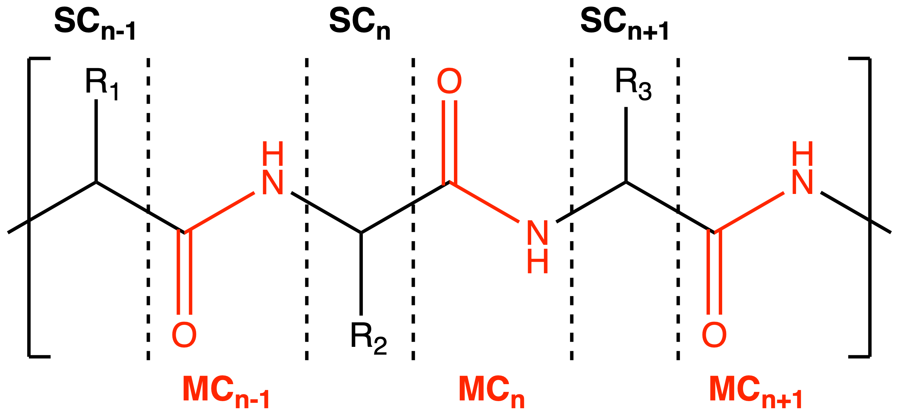

# 2025-07 Contact analysis update

As of July 2025, all selection schemes (probe/arpeggio/distance) have been updated to group the selected atoms/contact counts from standard amino acid residues by protein functional groups (side chains and peptide bonds) instead of by residue IDs, as shown in the image above. 
This matches the partitioning used for F-SAPT analysis/ranking and the structural building blocks used in the trimming procedure. 
The different parts of each residue are now listed and ranked independently in `res_atoms.dat`, so they can be added at different stages of the stepwise model building. 

These examples show off each of the probe, arpeggio and distance selection/ranking schemes. For probe and arpeggio, examples of both the new FG grouping and old residue grouping approaches are provided. 
`2cht_h_corrected_new.clean.pdb` has been processed with the `pdb_clean.py` script to avoid issues with arpeggio.

### Things demonstrated by these examples:

1. New grouping generally increases the size label for the same maximal model
   - The numbering of the models is based on the number of separate groups that are added, i.e. the number of (non-comment) lines in `res_atoms.dat`, so more groups = a larger number of models
   - See examples: `probe/new_FG-grouped/res_14_h.pdb` and `probe/old_res-grouped/res_13_h.pdb` are maximal models with the exact same composition. However, the new incremental scheme is significantly different in how it handles residue 60, which has both MC and SC atoms in contact with the seed. These atoms and their respective contact counts are now split into two separate groups

2. Arpeggio2rins now properly ignores proximal interactions
   - Turning off proximal interactions in the original version of arpeggio2rins only changed the contact counts, not the set of selected atoms
   	- If all atoms in a residue only had proximal interactions, that residue would still be shown in `res_atoms.dat` when proximal interactions were turned off, but with a contact count of zero. It was up to the user to manually edit/delete these `res_atoms.dat` lines or discard the extraneous model files
	- If all main chain atoms of a residue had only proximal interactions with the seed but the side chain atoms had other interaction types, or vice versa, RINRUS would still include all atoms in the building process. This would add unnecessary parts of the residue to the QM-cluster models, but it was not clear to users that these parts _were_ unnecessary because the residue's overall contact count was non-zero
   - The new version fixes the above two issues. Atoms with only proximal contacts are only included in `res_atoms.dat` if proximal interactions are deliberately switched on
   - The maximal models `arpeggio/old_res_grouped/res_15_h.pdb` and `arpeggio/new_FG_grouped_withprox/res_22_h.pdb` are exactly the same (but again the new grouping increases the number of possible models)
   - The new, maximal model with proximal interactions switched off `arpeggio/new_FG_grouped/res_15_h.pdb` is significantly smaller (218 atoms vs 285 atoms)
   - When Arpeggio proximal interactions are turned on, the maximal model is effectively a closest distance-based model, as proximal contacts are any non-hydrogen atom pairs within 5 A of each other
   - Using the RINRUS `dist_rank.py` function with '-type closest -max 5 -noH' gives the exact same maximal model (`closest-distance/no-H/res_22_h.pdb`) as arpeggio with proximal interactions included

3. Major changes to how peptide bond functional groups are listed in `res_atoms.dat`
   - `res_atoms.dat` requires atoms to be grouped by their residue IDs, but the atoms in peptide bond/main chain functional groups come from two different residues 
   - If only one "side" of the peptide bond has contacts with the seed, a single line is added to `res_atoms.dat` as usual
	- For example, the C:59:MC peptide bond group could be represented by either of these lines depending on its orientation with respect to the seed
	- `C  59   100   O`; OR
	- `C  60   100   H`
   - If both sides of the peptide bond have contacts with seed, having two discrete lines representing the C-terminus of one residue and the N-terminus of the adjacent would unnecessarily create redundant models
   - Our current solution is to include both lines but comment out the second one (containing the N and/or H atoms of res i+1) so that the user can see when both sides have contacts, but the second line will not be read by `rinrus_trim2_pdb.py` or counted as its own group in the model building procedure. See `arpeggio/new_FG-grouped_withprox/res_atoms.dat`

4. Simplified outputs of probe2rins/arpeggio2rins scripts
   - Detailed information about the different types of contacts identified was previously given in the files `2cht_h_corrected_new.clean.sif`, `freq_per_res.dat` and `rin_list.dat` when using probe and probe2rins, or in `node_info.dat` when using arpeggio and arpeggio2rins
   - To consolidate data and improve both filename convention and formatting consistency, this information is now given in table format in `FG_probe_counts.dat`/`FG_arpeggio_counts.dat` 
   - The selection files created by `arpeggio2rins.py` are now called `res_atoms.dat` and `res_atoms_types.dat` for consistency with the other selection/ranking schemes. Previously they had been called `contact_counts.dat` and `contype_counts.dat` to differentiate arpeggio schemes from probe schemes, but this is no longer needed now that the files contain header lines documenting how they were generated

### Warning about possible discontinuities in sequential model building!

The RINRUS trimming algorithm has a condition for "disconnected" glycine or alanine side chains [or any residue where CA and/or its hydrogen(s) are the only atoms selected]. 
If the condition is met then main chain groups will be added on both sides to avoid creating floating methane or ethane molecules in the QM-cluster models. 
When making the full set of incrementally built models with `rinrus_trim2_pdb.py`, each model is built independently of the others. 
If this condition is only met in intermediate models, there is an additional edge case where the extra main chain atoms will subsequently be removed as the model size expands. 

The example in `probe/new_FG-grouped/` shows how this can potentially cause issues (specifically look at the `seq_model_contents.dat` file)

- In model 6, the C:59 alanine side chain is directly added to the model based on `res_atoms.dat`. Additional groups are added by the following logic:
   - No parts of C:58 or C:60 are in the model yet, so the disconnected alanine condition is met and the C:58:MC and C:59:MC groups are added to anchor the C:59:ALA side chain
   - Adding C:58:MC means that the C:57 (which was added in model 3) and C:58 alpha carbons are now both present, so the C:57:MC peptide bond must be added to connect them
   - Because C:57:MC contains the N-terminus of C:58, which is a proline, the C:58:PRO side chain must be added too, because of existing conditions for adding the unique peptide structure of PRO residues
- The disconnected alanine condition is also met in models 7-12, so C:57:MC/C:58:SC/C:58:MC/C:59:MC are added in these models
- Then in model 13, C:59:MC is directly added to the model
   - Now that the disconnected alanine condition is not met (because the SC and MC of C:59:ALA is explicitly included), C:58:MC does not get added, then neither do the C:57:MC and C:58:PRO_SC
   - Model 13 ends up being 16 atoms smaller than model 12! (In fact, even model 14, which is the maximal model, is one atom smaller than model 12)

There are two ways of working around this scenario:
1. The easiest way is to edit `res_atoms.dat` to explicitly add both main chains with the side chain so neither will be deleted from the model
   - For this example, we specifically add all C:59 main chain atoms to the same line as the alanine side chain so that these groups will never be deleted (see example where "C O N H" is added to the end of line 7 in `probe/new_FG-grouped/keep-C58/res_atoms.dat`)
   - Models 6-12 are unchanged, while models 13 and 14 include C:57:MC/C:58:SC/C:58:MC 
2. Note which main chain is being added to the model when the extra groups are deleted, and explicitly add it with the side chain to prevent the extra groups being added in the first place
   - For this example, C:59:MC is what stops the disconnected alanine condition from being met in model 13, so adding just the C:59 C and O main chain atoms at the same time as the side chain prevents C:58:MC from being added in model 6 (see example in `probe/new_FG-grouped/never-add-C58/`)
   - The C:57 and C:59 alpha carbons are two sequence values apart. Without C:58:MC, further main chain atoms will not be added to connect C:57 and C:59, so C:57:MC/C:58:SC are not added either
   - This changes models 6-12 and keeps models 13 and 14 the same
   - This approach generates smaller QM-cluster models than the first workaround 

